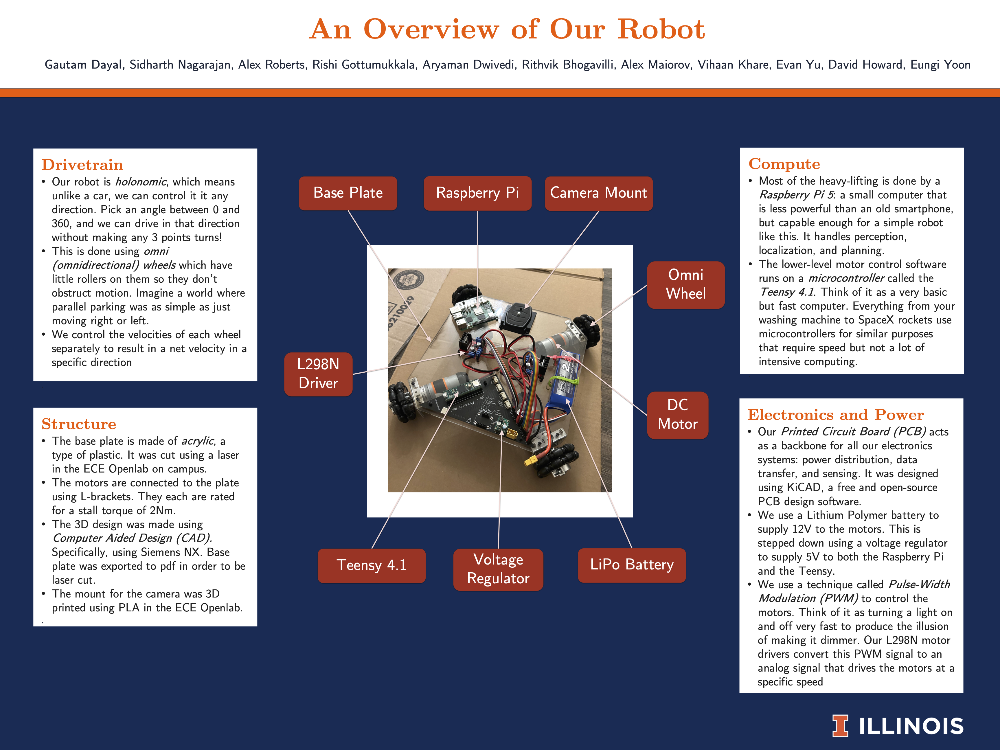
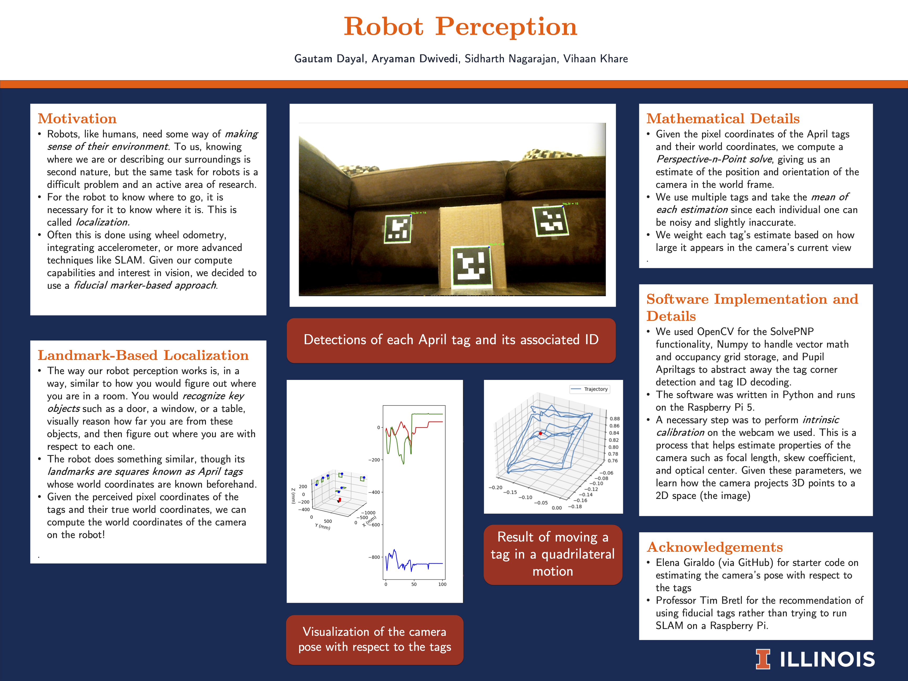
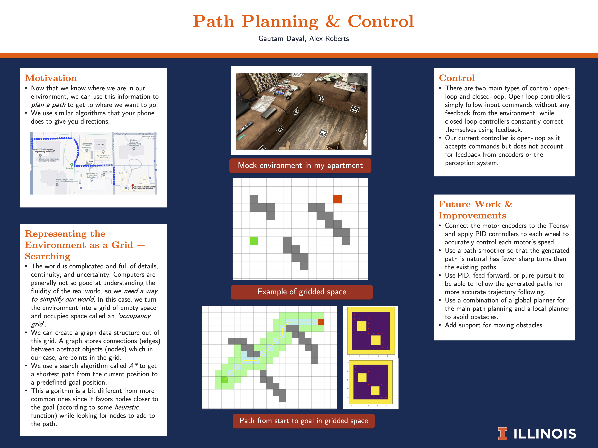

# TOFU: Tracking Omnidirectional Field Unit

This repo contains the software for both the Raspberry Pi (perception + planning) and Teensy 4.1 (control) parts of the autonomy stack.

    ></img></a> 

### Perception
Simple vision-based perception that uses fiducial tags for localization and object detection. Runs on RasPi.
**Input:** Sequence of camera images
**Output:** Robot position estimate & occupancy grid

    ></img></a> 

### Planning 
Grid search from current position to goal using A*. Runs on RasPi.
**Input:** Occupancy grid
**Output:** Sequence of waypoints for the robot to follow

    ></img></a> 

### Control
Ensure path computed by planning is following by robot. Commands sent from RasPi to Teensy. Teensy drives motors. 
**Input:** Waypoints
**Output:** Motor commands
